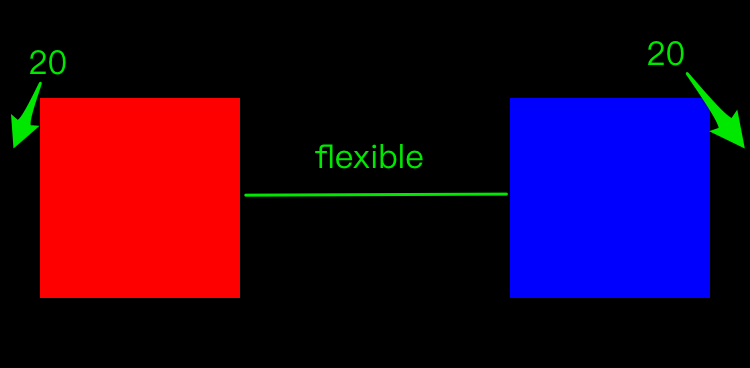
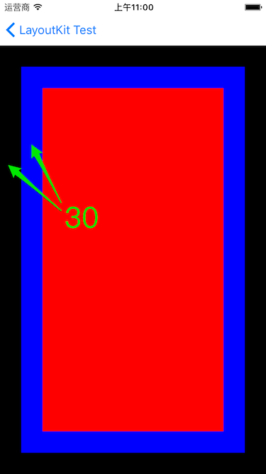

# LayoutKit
使用 swift 编写的 view 布局库

## 目录
* [AutoLayout 的问题](#auto_layout_problem)
* [使用例子](#use_example)
* [环境要求](#requirement)
* [安装](#install)
* [概览](#overview)
* [使用](#how_to_use)
* [API 描述](#api_desc)


## <a name="auto_layout_problem">AutoLayout 的问题</a>
iOS/macOS 开发中为了适应多种尺寸，会使用 AutoLayout。但 AutoLayout 有些问题：

* 没有占位符。导致一些界面使用一些看不见的占位 view。
* 一些很常见的界面布局，比如等间距，用 AutoLayout 难以表述。
* 需要配置很多约束，就算使用 [Masonry](https://github.com/SnapKit/Masonry) 或 [Cartography](https://github.com/robb/Cartography) 等布局库，约束设置也比较繁琐。
* 一些场合下，比如快速滚动列表，使用 AutoLayout 会有性能问题。

比如
### <a name="ui_1">界面1</a>


这种布局在 TableViewCell 中很常见，左边是一张图片，中间是字体不同的 label，几个 label 整体需要上下居中，最靠右是时间标签。

这种布局用 AutoLayout 表示，通常需要将几个 label 放到一个看不见的 view 上面。

<a name="ui_2"></a>
### 界面2


三个色块代表三个按钮，已经知道大小，需要左右排列。并且使得间距 1、2、3、4 相等。这种等间距布局也很常见，而用 AutoLayout 配置起来就十分麻烦。

为此基于传统的 frame 布局，编写了这个 LayoutKit。我没有否认 AutoLayout 的作用。一些场合，比如多语言文字自动适配大小，基于各个子 view 的大小自动算出父 view 的大小。这种传统的 frame 布局是做不到的。

AutoLayout 和 frame 布局可以结合起来使用，各取优缺点。

<a name="use_example"></a>
## 使用例子
使用 LayoutKit 实现上述两个界面布局，使大家有个初步的认识。

### [界面1](#ui_1)

```Swift
self.tk_layoutSubviews { make in
    // 1
    let iconHeight = make.yFlexibleValue(10, make.flexible, 10)
    // 2
    make.size(iconView) == (iconHeight, iconHeight)
    // 3
    make.sizeToFit(titleLabel, detailLabel, longDetalLabel, timeLabel)
    // 4
    make.xPlace(10, iconView, 10, titleLabel, make.flexible, timeLabel, 10)
    // 5
    make.ref(titleLabel).xLeft(detailLabel, longDetalLabel)
    // 6
    make.yCenter(iconView, timeLabel)
    // 7
    make.yPlace(make.flexible, titleLabel, 6, detailLabel, longDetalLabel, make.flexible)
}
```
	
1. 算出 icon 的高度。
2. 设置 icon 的大小。
3. 设置各个 Label 的大小。
4. 水平排列 icon、titleLabel、timeLabel，并设置好各自的间距。
5. 根据 titleLabel 左对齐 detailLabel、longDetalLabel。
6. iconView、timeLabel 垂直居中。
7. 垂直排列 titleLabel、detailLabel、longDetalLabel，并居中。

### [界面 2](#ui_2)

```Swift
self.tk_layoutSubviews { make in
    // 1
    make.size(redView, blueView, greenView) == (80, 80)
    
    let F = make.flexible
    // 2
    make.xPlace(F, redView, F, blueView, F, greenView, F)
    // 3
    make.yCenter(redView, blueView, greenView)
}
```
    
1. 设置各个 view 的大小。
2. 水平排列 redView、blueView、greenView，并设置好各自的间距。
3. 各个 view 垂直居中。

<a name="requirement"></a>
## 环境要求
* Swift 3.0+
* Xcode 8.0+
* iOS 8.0+ / macOS 10.10+

<a name="install"></a>
## 安装

### Carthage

在您的 `Cartfile` 添加上这一行

```ogdl
github "hjcapple/LayoutKit" "HEAD"
```

运行命令 `carthage update` 生成 `LayoutKit.framework`，将其添加到工程中。

### 手动安装

下载代码，将 `LayoutKit.xcodeproj` 添加到工程当中。

<a name="overview"></a>
## 概览

这个库的 API 设计成跟另一个库 [AutoLayoutKit](https://github.com/hjcapple/AutoLayoutKit) 相似，AutoLayoutKit 使用 AutoLayout 的约束来实现布局。假如您对这个库有兴趣，很可能会对 AutoLayoutKit 也有兴趣。

界面布局，大致分解成 3 步：

1. 设置大小。
2. 水平方向排列各个 views。
3. 垂直方向排列各个 views。

AutoLayoutKit 提供 API 分别设置大小、水平位置、垂直位置。水平方向和垂直方向使用数轴的概念：

* 水平方向，就是 x 方向。
* 垂直方向，就是 y 方向。

API 设计中

* `xLeft`、`xRight`、`xCenter`、`xPlace` 等就是设置 x 方向。
* `yTop`、`yBottom`、`yCenter`、`yPlace` 等就是设置 y 方向。

<a name="example0"></a>
很多界面布局库用起来繁琐，是它每次只操作一两个 view，但事实上我们更关心界面的整体布局。LayoutKit 将所有的 views 作为一个整体，一次排列多个 views，比如：

```Swift
make.xPlace(20, redView, make.flexible, blueView, 20)
```
	
这个调用，就出现下列布局:



<a name="flexible"></a>
### flexible

LayoutKit 利用 flexible 占位符，来动态计算布局距离。根据总长度减去布局中出现的长度，剩余的长度被 flexible 占位符平分。

比如[上面例子](#example0)，假设总宽度为 375，redView 和 blueView 的宽度都为 100，这样 flexible 就计算得出：

```Swift
flexible = 375 - (20 + 100 + 100 + 20) = 135
```
	
也可以出现多个 flexible，比如

```Swift
make.xPlace(make.flexible, redView, blueView, make.flexible)
```
	
这代码就使得 redView 和 blueView 靠在一起，x 方向居中，而

```Swift
let F = make.flexible
make.xPlace(F, redView, F, blueView, F)
```
	
剩余空间被 3 个 flexible 均分，就产生均匀间距的布局。

另外 flexible 还可以乘以一个数字，比如 `make.flexible * 2`，就相当于 2 个 flexible。比如

```Swift
let F = make.flexible
make.xPlace(F, redView, F * 2, blueView, F)
```
	
也可以乘以一个小数，比如：
	
```Swift
let F = make.flexible
make.xPlace(F * 0.5, redView, F, blueView, F * 0.5)
```
	
flexible 可以用在计算高度和宽度，比如：
	
```Swift
make.height(redView, blueView, yellowView) == [44, make.flexible, 44]
make.xEqual(redView, blueView, yellowView)
make.yPlace(redView, blueView, yellowView)
```
    
将 blueView 的高度设置成 flexible，就产生下面界面：


<a name="bounds"></a>
### 布局 bounds

布局 bounds 表示 view 需要放置在哪里，是一个用于参考的矩形。比如左对齐，就隐含了左边界在哪里。flexible 的值也是根据 bounds 的高度和宽度来计算的。

刚开始时，布局 bounds 等于父 view 的 bounds, 当也可以通过一些 API 去修改。比如：

```Swift
make.insetEdges(edge: 30)
make.equal(blueView)
    
make.insetEdges(edge: 30)
make.equal(redView)
```
    
bounds 先插入边距，放置 blueView, 再插入边距，再放置 redView, 就产生下面布局： 



也可以分别设置上下左右的边距，之后通过 resetBounds 来还原 bounds，比如：

```Swift
do {
    let oldBounds = make.insetEdges(top: 10, left: 20, bottom: 40, right: 50)
    defer {
        make.resetBounds(oldBounds)
    }
    // do something
}
```
	
<a name="how_to_use"></a>
## 使用
覆写

 * UIView 的 layoutSubviews 函数，
 * 或者 UIViewController 的 viewDidLayoutSubviews

在其中使用 LayoutKit, 比如

```Swift
override func layoutSubviews() {
    super.layoutSubviews()
    
    self.tk_layoutSubviews { make in
        // 布局
    }
}
```
    
另外可以实现一个简单的基类 View，存储一个闭包，这样就不用存储各个字 view 的引用，注意这种方式中闭包中用到 self, 需要使得 self 为弱引用 `[weal self] in`

```Swift
override init(frame: CGRect)
{
    super.init(frame: frame)
    
    let blueView = self.addColorSubView(UIColor.blueColor())
    self.onLayoutSubviews = { [weak self] make in
        make.insetEdges(edge: 30)
        make.equal(blueView)
        
        // do something
    }
}
```
    
具体见例子工程。

<a name="api_desc"></a>
## API 描述

上面提到，界面布局大致分解成 3 步：

1. 设置大小。
2. x 方向排列各个 views。
3. y 方向排列各个 views。

LayoutKit 也就提供 API 分别完成这三个步骤，而 x 排列和 y 排列是对称的。

### 修改 bounds 

```Swift
func insetEdges(top: CGFloat, left: CGFloat, bottom: CGFloat, right: CGFloat) -> CGRect
func insetEdges(edge: CGFloat) -> CGRect
```
	
上面已经有[布局 bounds](#bounds)的描述，上面两个 API 是在 bounds 中插入边距，从而改变 bounds，并返回旧的 bounds。

```Swift
func resetBounds(bounds: CGRect)
```
	
也可以直接设置 bounds, 通常用于还原旧的 bounds。

### 取得 bounds 大小
	
```Swift
make.w // 取得 bounds 宽度
make.h // 取得 bounds 高度
```
	
### 设置 size
用法：

```Swift	
make.size(view0, view1, view2) == CGSize(width: 100, height: 100)
```
	
将所有 views 设置成对应的大小。另外可以简写成。

```Swift
make.size(view0, view1, view2) == (100, 100)
```
	
也可以传入数组，比如

```Swift
let views = [view0, view1, view2]
make.size(views) == (100, 100)
```
	
所有 API 中，假如可以连写多个 views，都可以用数组作为参数，下面不再多说。
	
### 设置 width

用法
	
```Swift
make.width(view0, view1, view2) == 10
```
	
将所有 views 都设置成同一个值。

另外也可以将 view 独自设置，如：

```Swift
make.width(view0, view1, view2) == [10, 20, 30]
make.width(view0, view1, view2) == [10, 20, make.w * 0.5]
```
	
也可以使用 flexible, 比如

```Swift
make.width(view0, view1, view2) == [44, make.flexible, make.flexible * 2]
```
	
flexible 见[上面的描述](#flexible)。

左右参数个数不相等时，会不设置多余的参数。比如：

```Swift
make.width(view0, view1) == [make.flexible, make.flexible, make.flexible * 2]
```
	
比如根据右边参数，共有 4 个 flexible，算出每个 flexible 的宽度，也就是 view0 和 view1 都被设置成 1/4宽度。

另外左边可以用占位符，比如

```Swift
make.width(make.placeHolder, view0) == [44, make.flexible]
```
	
占位符宽度为 44, 因此 view0 的宽度为 bounds.width - 44。

### 设置 height
height 的设置跟 width 对称。

```Swift
make.height(view0, view1, view2) == 10
make.height(view0, view1, view2) == [10, 20, 30]
make.height(view0, view1, view2) == [10, 20, make.w * 0.5]
make.height(view0, view1, view2) == [44, make.flexible, make.flexible * 2]
make.height(make.placeHolder, view0) == [44, make.flexible]
```
	
### flexible

```Swift
make.flexible 
```
	
表示有 1 个 flexible。

```Swift
make.flexible * 2
2 * make.flexible
```
	
表示有 2 个 flexible

```Swift
make.flexible * 0.5
0.5 * make.flexible
```
	
表示有 0.5 个 flexible

### 计算每个 flexible 的值

```Swift
xFlexibleValue
yFlexibleValue
```
	
比如总高度为 600, redView 高度 100，blueView 高度为 100。这样

```Swift
let F = make.flexible
let value = make.yFlexibleValue(F, redView, 10, blueView, F)
```
	
每个 flexible 的值为

```Swift
value = (600 - (100 + 10 + 100)) / 2
```
	
### xLeft, xRight, xCenter

传入的 views 在 x 方向，靠左、靠右、居中。

比如

```Swift
make.xCenter(view0, view1, view2)
```

### yTop, yBottom, yCenter

传入的 views 在 y 方向，靠上、靠下，居中。

比如

```Swift
make.yCenter(view0, view1, view2)
```
	
### center

在 x, y 方向上都居中，相当于先调用 xCenter 再调用 yCenter。
	
### xPlace

在 x 方向上，从左到右放置各个 views，并设置好间距。

比如

```Swift
make.xPlace(10, view0, 10, view2, make.flexible, view3)
```
	
关于 make.flexible 的描述，[见上文](#flexible)。
	
### yPlace

在 y 方向上，从上到下放置各个 views，并设置好间距。

```Swift
make.yPlace(10, view0, 10, view2, make.flexible, view3)
```
	
关于 make.flexible 的描述，[见上文](#flexible)。

### xPlace fixed 

第一个 view 固定不动，再排列各个 views。

比如有个 iconView，已经设置好大小和位置。现在需要在它的右边，距离 10 point 放置一个 label, 就可以使用：

```Swift
make.xPlace(fixed: iconView, 10, label)
```

当然也可以固定最后一个 view 不动。比如有个 iconView，已经设置好大小和位置。现在需要在它的左边，距离 10 point 放置一个 label, 就可以使用：

```Swift
make.x(make.flexible, label, 10, fixed: iconView)
```
	
### yPlace fixed

跟 x 方向的相应函数对应。

### ref

以某个 view 为基准，对齐其它 views。比如：

```Swift
make.ref(labe0).xLeft(label1, label2, label3)
```	
	
这样 label1, label2, label3 跟 label0 左对齐。另外

```Swift
make.ref(labe0).xRight(label1, label2, label3)
```
	
这样 label1, label2, label3 跟 label0 右对齐。

其它的 
	
```Swift
make.ref(xxx).yTop
make.ref(xxx).yBottom
make.ref(xxx).xCenter
```
	
等等意义也是一样。

### xEqual

在 x 方向上，使得 views 的宽度和 bounds 一样，并且靠边。也就是在 x 方向上铺满。

```Swift
make.xEqual(view0, view1, view2)
```
	
相当于

```Swift
make.width(view0, view1, view2) == make.w
make.xLeft(view0, view1, view2)
```
	
同时设置了宽度和 x 位置。

### yEqual

跟 xEqual 对称。

### equal

使得 views 直接占据整个 bounds。相当于同时调用，xEqual 和 yEqual。这个函数，跟 insetEdges 配合起来很容易设置边距。比如

```Swift
make.insetEdges(edge: 20)
make.equal(redView)
```

这样，就将 redView 设置成距离边距 20。


